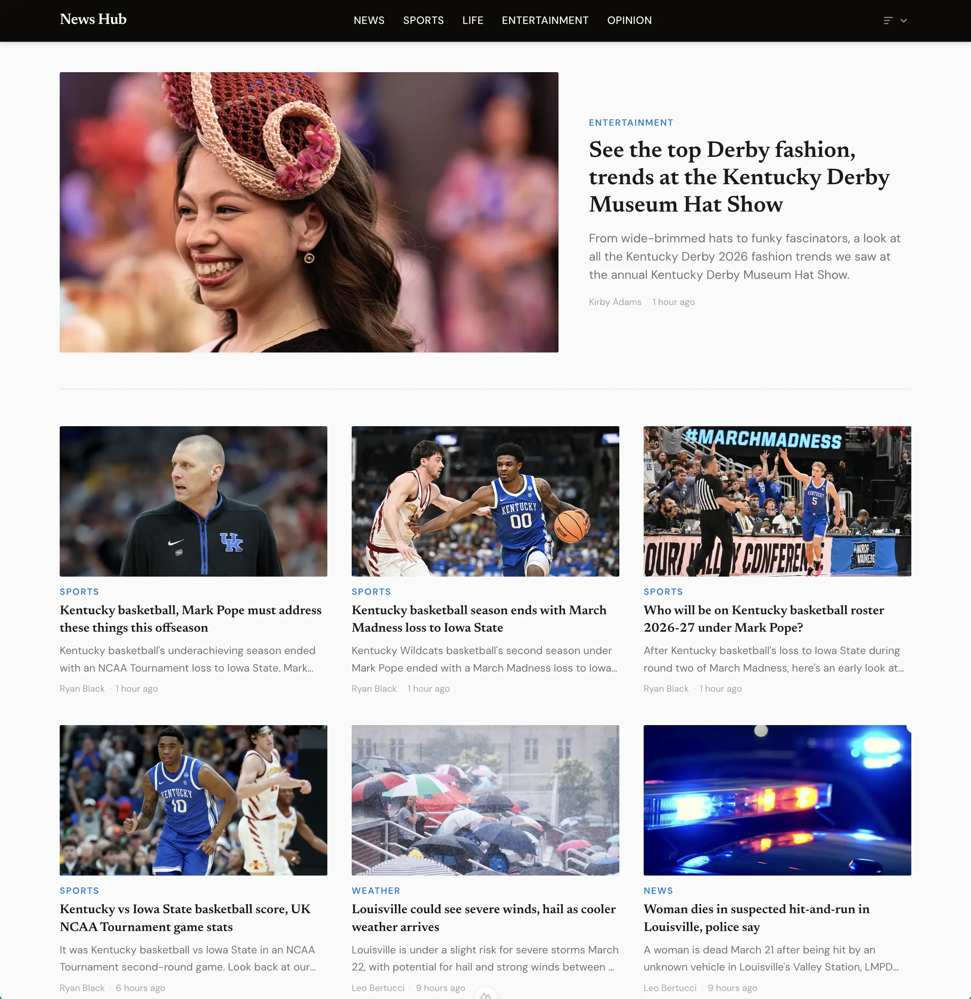
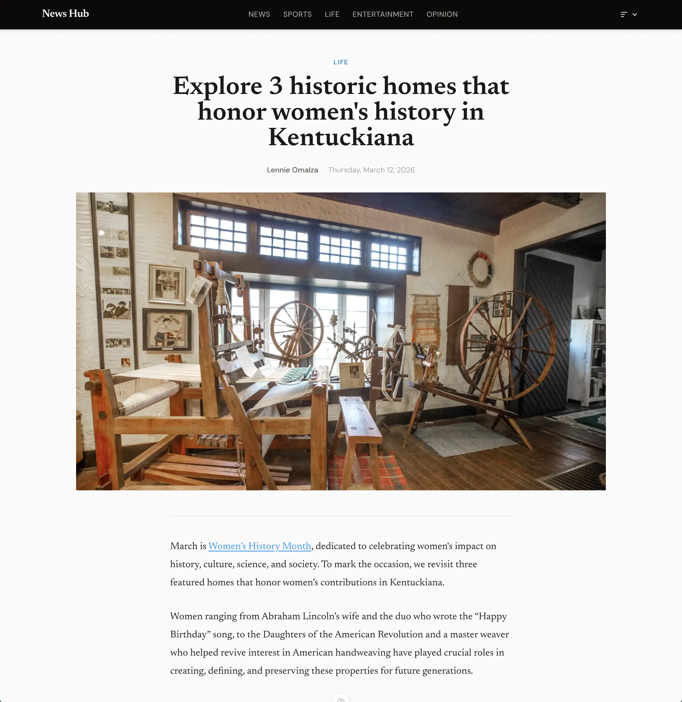
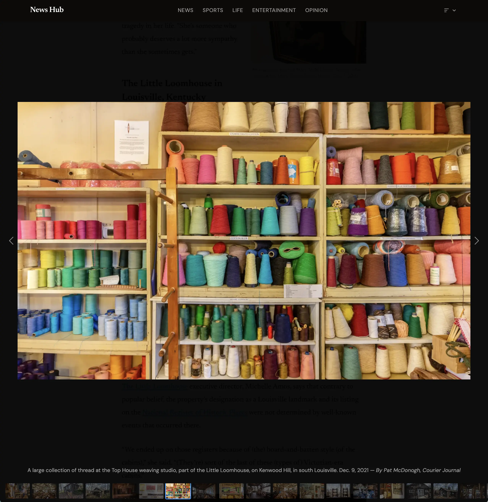

# News Hub 🗞️

A simplified, no-nonsense newsreader application for the Courier Journal and other Gannett-owned news sources.

> **Note**
> This repository is for a personal application that runs on my private home network. It intentionally omits critical components required for public use, as those would enable bypassing publisher paywalls. Those details will not be provided. I keep this repo public for educational purposes.

## Features

- Built with Nuxt 4 for performance, portability, and ease of modification
- Removes ads
- Removes trackers
- Clean inline media consumption for photos, videos and galleries
- Videos no longer autoplay with the option to remove them completely
- Eliminates distracting, irrelevant or unrelated popups and embeds (e.g., newsletter signups, promotional blocks)
- Supports multiple feed sort options to cater to how you consume news best
  - Newest
  - Curated (site-defined order as the publication intended)

## Screenshots

### Feed View

Clean, chronological or curated feed with no ads or distractions.



### Article View

Distraction-free reading experience.



### Gallery View

Lightbox for quick and easy inline media consumption.



## Impetus

[Many users](https://www.reddit.com/r/newsboat/comments/168vt8t/usatoday_and_all_other_gannettowned_newspapers/) were frustrated when Gannett quietly discontinued its RSS feeds. I was also [directly affected](https://github.com/jwhazel/news-reader). [Workarounds](https://mastogizmos.com/grog.html) were attempted, but so far nothing has come close.

I have no problem paying to support strong local journalism. However, the current experience across Gannett websites is lackluster at best. Heavy [resource intensive advertising](https://x.com/paulcalvano/status/1000094333524201473), intrusive interstitials with [dark patterns](https://braedon.dev/2022/gannett-spoofing.html), unrelated videos that force autoplay, and overall poor UX make it unnecessarily difficult to consume news.

This project is a personal solution to that problem—bring back the simple feed we enjoyed with RSS... but also wrap a lightweight easy to use interface around it.

To build it, I used [HTTP Toolkit](https://httptoolkit.com/) to inspect requests made by the official mobile app. The implementation closely emulates those requests to leverage the same cached content so as to not place additional burden on their infrastructure.

The idea is not to bypass any content protection schemes, but rather to make the content I'm already paying for more accessible.

## Setup

### Development

Create a `.env` file with the following values:

```bash
CONTENT_ENDPOINT=   # Gannett API content URL
CONTENT_API_KEY=    # Associated API key
SITECODE=           # 4-letter site code identifier
USER_AGENT=         # User agent string used to mimic the mobile app
MEDIA_BASE_URL=     # Domain used to rewrite media CDN URLs
```

Install dependencies and start the development server:

```bash
npm ci
npm run dev
```

The app will be available at [http://localhost:3000](http://localhost:3000).

### Production / Deployment

Ensure Docker is installed, then run:

```bash
docker compose up --build
```

This builds and runs the Nuxt application in a container.

## TODO

- Improve image sizing to exactly match desktop responses (currently off by ~1–3px due to scaling calculations)
- Better understand “fronts” (e.g., why "lifestyle" is labeled as "life")
- Evaluate adding subsections and topics to navigation
- Add author landing pages with recent articles
